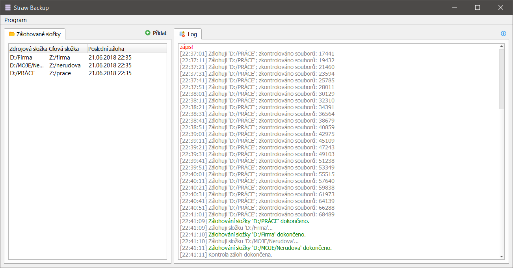

# Straw Backup
Straw Backup je jednoduchý prográmek na zálohování složek. Běží na pozadí a v nastavených intervalech zálohuje vybrané složky na zvolené destinace. Program umí i po určitou dobu uchovávat historii změn souborů. Běží na pozadí.

Instalačka k dispozici zde: https://straw-solutions.cz/?/ke-stazeni

Zříkám se jakékoli odpovědnosti za vaše soubory.

Program je psaný v Qt/C++.